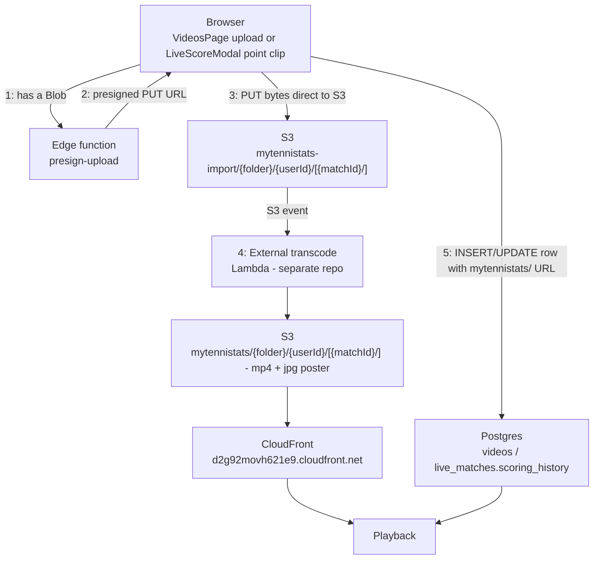

# myTenniStats

Tennis stats tracker, live scoreboard and video analysis app — [mytennistats.com](https://mytennistats.com).

Players, parents and coaches record match results, run a live scoreboard that can be shared
in real time with a public link, and attach short video clips to individual points for later
review.

---

## Stack

| Layer | Technology |
| --- | --- |
| Frontend | React 18 + TypeScript, Vite, Tailwind CSS |
| Hosting | Vercel (static SPA build) |
| Database / auth | Supabase (Postgres + RLS, GoTrue auth, pgvector) |
| Server-side logic | Supabase Edge Functions (Deno) |
| Video storage | AWS S3 + CloudFront, with an external transcode pipeline |
| Payments | Stripe Checkout + webhook |
| AI | Mistral (rules chat, embeddings), Groq Whisper (audio transcription) |
| Analytics | Google Analytics (gtag) + Vercel Analytics |

---

## Getting started

### Prerequisites

- Node.js 18+
- A Supabase project
- The Supabase CLI, if you intend to deploy migrations or edge functions

### Environment

Create a `.env` in the repo root. Only three variables are read by the frontend:

```bash
VITE_SUPABASE_URL=https://<project-ref>.supabase.co
VITE_SUPABASE_ANON_KEY=<anon key>
VITE_STRIPE_PRICE_ID=price_xxx        # Premium subscription price
```

> `VITE_AWS_S3_BUCKET` and `VITE_AWS_REGION` may still be present in older `.env` files.
> They are no longer read by anything — S3 access moved server-side into the
> `presign-upload` edge function. They can be deleted.

Anything prefixed `VITE_` is **compiled into the public browser bundle**. Never put a
service role key, an AWS secret or a Stripe secret key in this file. Server-side secrets
belong in Supabase edge function secrets (see [Deployment](#deployment)).

### Run locally

```bash
npm install
npm run dev        # Vite dev server on http://localhost:5173
npm run build      # production build into dist/
npm run preview    # serve the production build locally
npm run lint       # ESLint
npm run typecheck  # tsc --noEmit
```

---

## How the app works

### Routing

There is no router library. [`src/App.tsx`](src/App.tsx) reads `window.location` directly and
listens for `hashchange`. It supports both hash (`#/live/<id>`) and path (`/live/<id>`) forms —
`vercel.json` rewrites every path to `index.html` so deep links work on refresh.

Three routes are **public** (no session required):

| Route | Page | Data source |
| --- | --- | --- |
| `/live/{matchId}` | `LiveMatchPage` | `get_live_match(uuid)` RPC |
| `/match-history/{matchId}` | `MatchHistoryPage` | `get_public_match_result(uuid)` RPC |
| `/shared-results/{shareId}` | `SharedMatchResultsPage` | `get_shared_match_results(uuid)` RPC |

Everything else requires a session. Without one the visitor gets `LandingPage` or `LoginPage`.

### Provider tree

Once authenticated, the app mounts nested context providers, each owning one slice of state:

```
LanguageProvider              i18n strings (FR/EN), always mounted
└── AuthProvider              Supabase session + user
    └── SubscriptionProvider  plan tier, feature flags, usage counters, limit checks
        └── TournamentDataProvider   tournaments + registrations, shared app-wide
            └── PlayersProvider      the user's player profiles
```

### Pages

| Page | Purpose |
| --- | --- |
| `HomePage` | Dashboard: upcoming tournaments, recent results, counters |
| `TournamentsPage` | Browse/filter the tournament catalogue, register players, calendar and map views |
| `MatchesPage` | Record match results, launch the Live Score modal, share results |
| `ClubsPage` | Club directory with map, distance sorting, personal notes |
| `VideosPage` | Video library — upload, tag, filter, play |
| `VideoEditorPage` | Trim/edit a clip before saving |
| `RulesPage` | RAG chat over the official ITF rules (pgvector + Mistral) |
| `SettingsPage` | Profile, players, subscription, account deletion |

### Live Score

[`src/components/LiveScoreModal.tsx`](src/components/LiveScoreModal.tsx) is the largest
component in the app. It owns the full scoring state machine: game/set scores, tiebreak and
super-tiebreak handling, no-ad scoring, serve rotation, undo, and per-point flags
(`isGamePoint`, `isBreakPoint`, `isSetPoint`, `isMatchPoint`).

Each point is appended to a `scoring_history` array persisted on the `live_matches` row and,
when the match is saved, on the `match_results` row. If point recording is enabled, each point
also produces a video clip (see [Video pipeline](#video-pipeline)).

Public viewers of `/live/{id}` poll every 15 seconds. They do not use Realtime — anonymous
visitors have no SELECT path on `live_matches`, and Realtime enforces RLS.

### Data model

Core tables, all with RLS enabled and owner-scoped policies (`auth.uid() = user_id`):

| Table | Contents |
| --- | --- |
| `user_profiles` | name, email, language |
| `user_players` | the player profiles a user tracks (a parent may track several children) |
| `match_results` | completed matches, including `scoring_history` JSON |
| `live_matches` | in-progress scoreboards, auto-expiring |
| `shared_match_results` | share links pointing at a set of `match_results` ids |
| `videos` | video library rows (CloudFront URL, poster, player, shot type, tags) |
| `tournaments`, `tournament_registrations`, `convocations` | tournament catalogue and entries |
| `clubs`, `club_comments` | club directory and per-user private notes |
| `user_subscriptions`, `user_feature_flags`, `user_usage_stats` | plan state and quota counters |
| `tennis_rules_documents`, `tennis_rules_chunks` | pgvector embeddings for the rules chat |

**Public reads go through `SECURITY DEFINER` functions, not table policies.** Anonymous
visitors have no direct grant on `match_results`, `videos`, `shared_match_results` or
`live_matches`. The three RPCs above take an id as an argument and return a single row with
`user_id` stripped. This is deliberate: an RLS policy of `USING (true)` cannot express
"only when the caller filtered by primary key" — PostgREST will happily return the whole
table — so share-by-unguessable-link has to be a function.

### Plans and limits

Defined in [`src/contexts/SubscriptionContext.tsx`](src/contexts/SubscriptionContext.tsx):

| Limit | Free | Premium |
| --- | --- | --- |
| Player profiles | 1 | unlimited |
| Match results | 3 | unlimited |
| Result shares | 3 | unlimited |
| Live score shares | 1 | unlimited |
| Live points recorded | 3 | unlimited |
| Video uploads | 3 | unlimited |
| Total video storage | uncapped (count-limited instead) | 1 GB |
| Max video duration | 60 s | 60 s |
| Rules chat responses | 3 | unlimited |

Counters live in `user_usage_stats` and are incremented through the `increment_usage_stat`
RPC. The client cannot `UPDATE` that table directly — a writable counter is a resettable
counter.

---

## Video pipeline

This is the part most likely to need changes, so it is documented end to end.

### Overview

Five steps, three of which are in this repo and two of which are not (the AWS side lives in
the separate `cdk-lambda-ffmpeg` CDK stack):

1. **Browser upload** — `VideosPage` (manual library upload) or `LiveScoreModal` (a point
   clip) has a video `Blob` and wants it in S3. Neither ever holds an AWS credential.
2. **Edge function issues a presigned URL** — the browser calls the `presign-upload` Supabase
   edge function (authenticated with the user's own session, nothing else). It resolves the
   caller's identity, builds the destination key server-side, and returns a short-lived
   presigned S3 PUT URL — this repo's code never sees an AWS access key.
3. **Browser uploads straight to S3** — the PUT goes directly from the browser to S3 using
   that presigned URL, under the **`mytennistats-import/`** staging prefix. Every key starts
   with the uploader's own user id, whichever folder it's in:
   - `mytennistats-import/recorded-videos/{userId}/{video-id}.ext` — manual upload.
   - `mytennistats-import/match-videos/{userId}/{matchId}/{video-id}.ext` — Live Score point
     clip, nesting the live match id one level further in.

   (`{video-id}` is a server-generated UUID leaf, not anything the client chose — see
   [Key construction](#key-construction-server-side-authoritative).)
4. **AWS processes the video (not in this repo)** — an S3 event on that prefix triggers the
   external Lambda pipeline: it transcodes to a web-friendly mp4 and generates a jpg poster
   frame (or, for already-playable Live Score clips, just copies them through unchanged), and
   writes the result under the **`mytennistats/`** prefix, mirroring the exact same path that
   followed the staging prefix (only that first segment changes — see the convention below).
5. **Supabase is updated** — the browser never waits for step 4. It already has the final
   CloudFront URL predicted from the presigned response (see the prefix-swap convention
   below) and writes it straight away: a new row in `videos` for a manual upload, or a patched
   `videoUrl` inside the `scoring_history` entry for a Live Score point. The clip can 404 for
   the few seconds until step 4 actually finishes.



### The `mytennistats-import/` → `mytennistats/` convention

This is the single most important thing to understand.

- Uploads always land under the **`mytennistats-import/`** prefix.
- An external Lambda (in the `ffmpeg-cdk-lambda-s3cloudfront` AWS stack — **not in this
  repo**) watches that prefix, transcodes the file, and writes the result under the
  **`mytennistats/`** prefix, mirroring the rest of the key.
- The app never waits for that. It takes the CloudFront URL it was given and predicts the
  final one before storing it, through **one shared helper** — every call site that needs
  this (`VideosPage`'s manual upload, and both branches of `LiveScoreModal`'s point-clip
  upload) goes through it rather than repeating the string substitution inline:

```ts
// src/utils/s3Upload.ts
const STAGING_PREFIX = '/mytennistats-import/';
const FINAL_PREFIX = '/mytennistats/';

export function toFinalVideoUrl(stagingUrl: string): string {
  return stagingUrl.replace(STAGING_PREFIX, FINAL_PREFIX);
}
```

```ts
// src/pages/VideosPage.tsx
const videoUrl = toFinalVideoUrl(s3Result.presignedUrl);
// poster comes from the same pipeline, same key with a .jpg extension
const posterImageUrl = videoUrl.replace(/\.(mp4|webm|mov|avi)$/i, '.jpg');
```

**Consequence:** the URL stored in the database is a *prediction*. It becomes valid only once
the Lambda finishes. A clip played immediately after upload can 404 until then. If you ever
need to change the prefix naming, `toFinalVideoUrl()` is the **only** place to edit on this
side — *and* the Lambda stack has to keep writing to whatever `FINAL_PREFIX` says, or every
predicted URL 404s forever instead of just for a few seconds.

### Upload paths

Two callers, both going through [`src/utils/s3Upload.ts`](src/utils/s3Upload.ts):

**1. Manual library upload** — `VideosPage`. Filename has no `/`, so it's treated as
`recorded-videos` and scoped under the uploader's own user id (see below). Duration and
storage are checked client-side before upload starts, then a `videos` row is inserted and
`increment_usage_stat` is called.

**2. Live Score point clips** — `LiveScoreModal`. Filename is
`` `${liveMatchId}/point-${sequence}-${Date.now()}.${ext}` ``. The leading UUID segment groups
a match's clips together under `match-videos/{userId}/{liveMatchId}/`. Uploads run in the
background with retry (`UPLOAD_RETRY_DELAYS_MS`) and never block the scoreboard; the clip URL
is patched into the `scoring_history` entry when it resolves. No `videos` row is created — the
URL lives inside the scoring history JSON.

Transfer mode is chosen by size in `s3Upload.ts`:

```ts
const MULTIPART_THRESHOLD = 10 * 1024 * 1024;  // >=10 MB -> multipart
const PART_SIZE           = 10 * 1024 * 1024;
```

Single uploads use `presign-single`. Multipart runs `initiate-multipart` →
`presign-parts` → PUT each part → `list-parts` → `complete-multipart`, with
`abort-multipart` on failure. Progress is reported per-part via `XMLHttpRequest`.

### Key construction (server-side, authoritative)

The client's filename is **not** used as a path. `buildS3Key()` (fed by `parseUpload()`) in
[`supabase/functions/presign-upload/index.ts`](supabase/functions/presign-upload/index.ts)
uses it only to pick the folder and the extension, then generates a fresh UUID leaf name:

```
mytennistats-import/recorded-videos/{userId}/{uuid}.{ext}               # manual upload
mytennistats-import/match-videos/{userId}/{liveMatchId}/{uuid}.{ext}    # live score clip
```

Every key starts with `{userId}/` — never taken from the client, always the authenticated
caller's own id (`buildS3Key(parsed, user.id)`) — so a user can only ever write under their
own folder:

- `recorded-videos/{userId}/…` — that's the whole scope, one level deep.
- `match-videos/{userId}/{liveMatchId}/…` — nests one level further under the live match id.
  Being a UUID isn't enough on its own to gate this: live match ids are public (they appear in
  every `/live/{id}` share link), so `presign-upload` also checks `live_matches.user_id`
  matches the caller before it will sign anything for that match — `ownsLiveMatch()` in the
  same file.

Constraints enforced there:

| Setting | Value |
| --- | --- |
| `ALLOWED_FOLDERS` | `match-videos`, `recorded-videos` |
| `ALLOWED_EXTENSIONS` | `mp4`, `webm`, `mov`, `avi`, `m4v`, `jpg`, `jpeg`, `png` |
| `ALLOWED_CONTENT_TYPES` | `video/*` or `image/*` |
| `KEY_PATTERN` | re-validates any client-supplied key on multipart continuation |
| Rejected outright | `..`, `\`, leading `/`, more than 2 path segments in the *client-supplied* filename (the match id, if any, plus the leaf) |

Two deliberate behaviours worth knowing before you change anything:

- **The leaf filename you send is discarded.** `point-3-1785311469802.mp4` becomes
  `{random-uuid}.mp4`. Point ordering is carried by the `scoring_history` entry, not the key.
  If you need identifying information in the key, add it to the *group* segment, not the leaf.
- **The random leaf is a security property, not a style choice.** It is what prevents a caller
  from aiming an upload at an existing object and overwriting another user's video.

### Deletion

Three separate paths remove videos, and one known gap is not yet closed:

**1. Single video** — [`src/utils/s3Delete.ts`](src/utils/s3Delete.ts) sends a **`videoId`**,
never a key. The `delete-video-from-s3` function looks the row up filtered by
`user_id = auth.uid()` and derives the S3 key from the stored (`mytennistats/…`) URL, so the
key is never client-supplied.

**2. Account deletion** — `delete-account` (see [Edge functions](#edge-functions)) runs
*before* the account's rows are removed. It collects every video URL the user has — `videos`
rows plus every `videoUrl` embedded in `live_matches`/`match_results` `scoring_history` — and
batch-deletes them from S3 (`DeleteObjectsCommand`, up to 1000 keys per call) before handing
off to the `delete_user_account` Postgres RPC that removes the rows themselves. A failed S3
delete is logged but never blocks the account deletion — losing a stray object is preferable
to trapping a user who wants to leave.

**3. `mytennistats-import/` staging objects are never deleted by the app.** The pre-transcode
original stays in the bucket forever once its transcoded copy exists under `mytennistats/` —
neither `delete-video-from-s3` nor `delete-account` know that key (they only ever learn the
*post-transcode* URL, which is the only one ever stored in Postgres). **This should be closed
with an S3 lifecycle rule** that expires objects under `mytennistats-import/` after ~24–48h,
rather than by trying to track and delete the staging key from application code — a
lifecycle rule also cleans up originals for uploads that failed transcoding or were abandoned
mid-flow, which the app could never reliably detect on its own. Not implemented yet; needs to
be added on the AWS side alongside the Lambda stack.

### Playback

CloudFront serves the `mytennistats/` objects. URLs are unsigned and the distribution is
public — anyone holding a URL can fetch the file indefinitely. URLs are no longer enumerable
(the `videos` table is not readable anonymously), but if you need real revocation you will
have to move to signed CloudFront URLs, which is not implemented today.

### Changing the video upload — checklist

| To change... | Edit |
| --- | --- |
| Size threshold / part size | `src/utils/s3Upload.ts` (`MULTIPART_THRESHOLD`, `PART_SIZE`) |
| Allowed file types | `ALLOWED_EXTENSIONS` + `ALLOWED_CONTENT_TYPES` in `presign-upload`, and the `accept` attribute in `VideosPage` |
| Key layout / folders / prefixes | `buildS3Key()` **and** `KEY_PATTERN` in `presign-upload`, **and** the Lambda stack — keep the `mytennistats-import/` → `mytennistats/` prefix pair and the per-user/per-match scoping in sync on both sides |
| Duration / storage caps | `FREE_LIMITS` / `PREMIUM_LIMITS` in `SubscriptionContext.tsx` |
| CloudFront host | `CLOUDFRONT_HOST` edge function secret (falls back to a hardcoded default) |
| Presigned URL lifetime | `expiresIn` in `presign-upload` (currently 3600 s) |
| Transcode behaviour, poster generation | The external `ffmpeg-cdk-lambda-s3cloudfront` stack — not in this repo |
| Staging-object cleanup | S3 lifecycle rule on `mytennistats-import/` — not implemented yet, see [Deletion](#deletion) |

After editing any edge function: `supabase functions deploy <name>`. Editing the file alone
changes nothing in production.

---

## Edge functions

All live in `supabase/functions/`. Shared helpers are in `_shared/`.

| Function | Auth | Purpose |
| --- | --- | --- |
| `presign-upload` | `requireUser` | Issues presigned S3 PUT URLs (single + multipart) |
| `delete-video-from-s3` | `requireUser` | Deletes a single video the caller owns |
| `delete-account` | `requireUser` | Batch-deletes every video a user owns from S3, then calls `delete_user_account` |
| `tennis-rules-chat` | `requireUser` + rate limit | RAG chat over the ITF rules via Mistral |
| `transcribe-audio` | `requireUser` + rate limit | Groq Whisper transcription |
| `process-tennis-rules-pdf` | admin secret | Indexes a rules PDF into pgvector |
| `create-checkout-session` | user JWT | Creates a Stripe Checkout session |
| `cancel-subscription` | user JWT | Cancels the Stripe subscription |
| `stripe-webhook` | Stripe signature | Applies subscription state changes |

A note on `_shared/auth.ts`: **`verify_jwt` is not authentication.** It only proves the caller
presented a valid project JWT — and the anon key is exactly that, shipped in the browser
bundle. Any function acting on behalf of a user must call `requireUser()`, which resolves the
real user from the token and rejects a bare anon key.

`stripe-webhook` is the exception: Stripe cannot present a user JWT, so its signature is the
only authentication it can have. There is no unsigned path — a request without a valid
signature is rejected before the body is parsed.

### Database functions: two rules, both mandatory

Postgres grants `EXECUTE` to `PUBLIC` on every new function, and `PUBLIC` includes `anon`.
A `SECURITY DEFINER` function bypasses RLS by design. Together that means **every new
`SECURITY DEFINER` function is callable by anyone holding the public anon key until you
explicitly revoke it** — `GRANT ... TO authenticated` does not remove PUBLIC's grant.

Every migration that creates one must end with:

```sql
REVOKE ALL ON FUNCTION public.my_function(args) FROM public, anon;
GRANT EXECUTE ON FUNCTION public.my_function(args) TO authenticated;  -- or service_role
```

An event trigger (`lock_down_new_functions_trg`, added in
`20260806140000`) does the REVOKE automatically at `CREATE FUNCTION`, so a new function is
born locked and you only need the GRANT. Write both anyway — the trigger needs superuser to
install and is refused on a hosted project where the migration role is not one. Check the
migration's output: `event trigger installed` means it is active, a `WARNING` means it is not.

Either way, `npm run check:grants` is the backstop that always works. It reads every
migration in order and fails if a function would be left with its default grant, so it
catches the omission before deploy rather than after.

**Default privileges cannot do this job.** `ALTER DEFAULT PRIVILEGES … REVOKE EXECUTE ON
FUNCTIONS FROM anon` looks like the right fix and is not: `pg_default_acl` stores only the
*extra* grants layered over PostgreSQL's built-in default, and the built-in default for a
function is `EXECUTE TO PUBLIC` — which `anon` is a member of. Verified on PG 15 and 17:
after revoking, `pg_default_acl` holds zero rows and a new function still reports
`has_function_privilege('anon', …, 'EXECUTE') = true`. Hence the event trigger.

And ownership guards must be NULL-safe. For an anonymous caller `auth.uid()` is NULL, and
`NULL != 'anything'` evaluates to NULL — not TRUE — so `IF auth.uid() != p_user_id THEN
RAISE` never fires and execution falls straight through to the body:

```sql
IF auth.uid() IS NULL OR auth.uid() <> p_user_id THEN
  RAISE EXCEPTION 'You can only ... your own account';
END IF;
```

Also set `SET search_path = public, pg_temp` (not just `public`).

These three omissions together are what made `delete_user_account` deletable-by-anyone; see
`20260802000000_fix_null_unsafe_function_guards.sql`. To audit what is currently reachable:

```sql
SELECT p.oid::regprocedure AS fn, p.prosecdef AS security_definer
FROM pg_proc p JOIN pg_namespace n ON n.oid = p.pronamespace
WHERE n.nspname = 'public' AND has_function_privilege('anon', p.oid, 'EXECUTE')
ORDER BY 1;
```

---

## Deployment

### Frontend (Vercel)

The site is a static SPA. Vercel builds with `npm run build` and serves `dist/`.
[`vercel.json`](vercel.json) rewrites all paths to `index.html` so deep links survive a refresh.
Pushing to the default branch triggers a deploy.

**This is the entire environment configuration Vercel needs** — Project Settings →
Environment Variables:

| Variable | Value | Notes |
| --- | --- | --- |
| `VITE_SUPABASE_URL` | `https://<project-ref>.supabase.co` | Same project as local dev |
| `VITE_SUPABASE_ANON_KEY` | the project's anon key | Public by design — safe in a browser bundle |
| `VITE_STRIPE_PRICE_ID` | `price_xxx` | The Premium subscription price |

That's it — **the web app never needs an S3 bucket name, an AWS region or a CloudFront
hostname.** It only ever talks to Supabase; Supabase's `presign-upload` edge function is the
only thing that knows about AWS, and it hands the frontend a ready-to-use presigned URL and a
finished CloudFront URL, not raw bucket/region details. Those three AWS values are
[edge function secrets](#edge-functions-1), configured on the Supabase side, not here. If you
ever find yourself wanting to add `VITE_AWS_*` variables to make a video feature work, that's
a sign the change belongs in `presign-upload` instead of the frontend — see
[Video pipeline](#video-pipeline).

### Database migrations

```bash
supabase link --project-ref <project-ref>
supabase db push
```

Migrations are timestamped SQL in `supabase/migrations/` and are applied in filename order.
Write them idempotently (`IF NOT EXISTS`, `DROP POLICY IF EXISTS`) — this database has been
edited through the dashboard in the past, so migrations may meet objects they did not create.

> **Keep migrations as the source of truth.** Some objects the app depends on were created
> directly in the dashboard and exist in no migration. If you make a schema or policy change
> in the Supabase UI, write the equivalent migration too — otherwise a rebuilt or branched
> database silently loses it.

### Edge functions

```bash
supabase functions deploy presign-upload
supabase functions deploy delete-video-from-s3
# ...or deploy them all
supabase functions deploy
```

Secrets are set per-project, not in `.env`:

```bash
supabase secrets set \
  AWS_REGION=eu-west-1 \
  AWS_ACCESS_KEY_ID=... \
  AWS_SECRET_ACCESS_KEY=... \
  AWS_S3_BUCKET=... \
  CLOUDFRONT_HOST=d2g92movh621e9.cloudfront.net \
  STRIPE_SECRET_KEY=sk_live_... \
  STRIPE_WEBHOOK_SECRET=whsec_... \
  MISTRAL_API_KEY=... \
  GROQ_API_KEY=... \
  ADMIN_TASK_SECRET=...
```

`SUPABASE_URL`, `SUPABASE_ANON_KEY` and `SUPABASE_SERVICE_ROLE_KEY` are injected by the
platform automatically.

This is the **only** place the app is told which S3 bucket and CloudFront distribution to
use — both are read exclusively by `presign-upload` (and its `AWS_S3_BUCKET` /
`AWS_REGION` / credentials by `delete-video-from-s3` and `delete-account` too):

| Secret | Value | Read by |
| --- | --- | --- |
| `AWS_S3_BUCKET` | the bucket name from the CDK stack (`s3BucketName` in `cdk-ffmpeg-lambda-stack.ts`) | `presign-upload`, `delete-video-from-s3`, `delete-account` |
| `AWS_REGION` | that bucket's region, e.g. `eu-west-1` | same three |
| `AWS_ACCESS_KEY_ID` / `AWS_SECRET_ACCESS_KEY` | an IAM user scoped to that bucket (see permissions note below) | same three |
| `CLOUDFRONT_HOST` | the distribution's domain, e.g. `d2g92movh621e9.cloudfront.net` | `presign-upload` only, to build the URL it hands back to the browser |

Changing buckets, regions or CloudFront distributions is a `supabase secrets set` call —
nothing in the frontend or its Vercel config ever needs to change for that.

The IAM user behind `AWS_ACCESS_KEY_ID` needs `s3:PutObject` and the multipart permissions on
the `mytennistats-import/` prefix (where `presign-upload` writes), and `s3:DeleteObject` on
the `mytennistats/` prefix (where `delete-video-from-s3` and `delete-account` delete from,
since only the post-transcode URL is ever stored). Scope the policy to those two prefixes,
not the whole bucket.

### Stripe

Point a webhook endpoint at
`https://<project-ref>.supabase.co/functions/v1/stripe-webhook` and set the resulting signing
secret as `STRIPE_WEBHOOK_SECRET`. Without it the function refuses every request by design.
See [`readme/STRIPE_SETUP.md`](readme/STRIPE_SETUP.md) and
[`readme/TEST_WEBHOOK.md`](readme/TEST_WEBHOOK.md).

---

## Repository layout

```
src/
  App.tsx              routing + provider tree
  lib/
    supabase.ts        client, auth config, shared TypeScript types
    functions.ts       edge function URL + auth header helpers
  contexts/            Auth, Subscription, Players, TournamentData, Language
  pages/               one file per route
  components/          LiveScoreModal, scoreboards, modals, landing page
  utils/               S3 upload/delete, importers, analytics
supabase/
  functions/           edge functions (Deno), _shared/ helpers
  migrations/          timestamped SQL
scripts/               club import, rules PDF indexing
readme/                per-feature setup guides
```

## Further reading

| Doc | Topic |
| --- | --- |
| [`readme/STRIPE_SETUP.md`](readme/STRIPE_SETUP.md) | Stripe products, prices, webhook |
| [`readme/TEST_WEBHOOK.md`](readme/TEST_WEBHOOK.md) | Testing the webhook locally |
| [`readme/MISTRAL_SETUP.md`](readme/MISTRAL_SETUP.md) | Rules chat and embeddings |
| [`readme/AUDIO_TRANSCRIPTION_SETUP.md`](readme/AUDIO_TRANSCRIPTION_SETUP.md) | Groq Whisper setup |
| [`readme/CLUB_IMPORT_GUIDE.md`](readme/CLUB_IMPORT_GUIDE.md) | Importing the club directory |
| [`readme/ANALYTICS_TRACKING.md`](readme/ANALYTICS_TRACKING.md) | Analytics event taxonomy |
| [`scripts/README.md`](scripts/README.md) | Indexing the ITF rules PDFs |